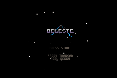

## == Celeste Classic GBA port ==

This is a port of Celeste Classic to the Game Boy Advance.

It's almost a direct conversion with minor graphical alterations.

### game credits:

Matt Thorson - design and audio

mattmakesgames.com

Noel Berry - code and art

noelfb.com

### Play the original game and view its source here:

lexaloffle.com/bbs/?tid=2145
